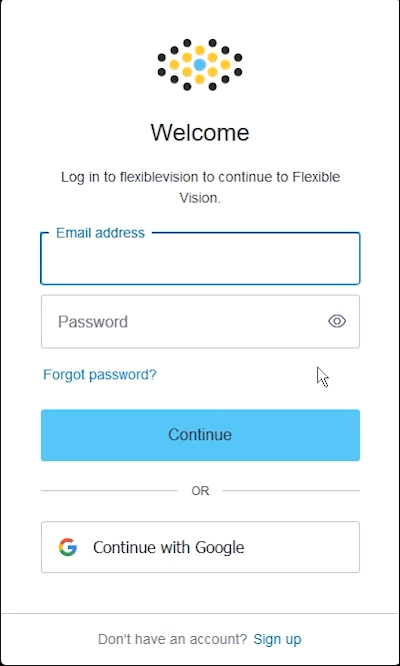
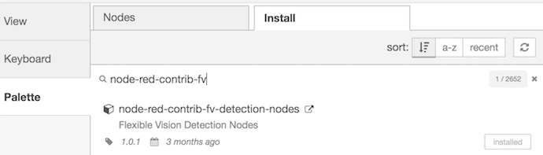
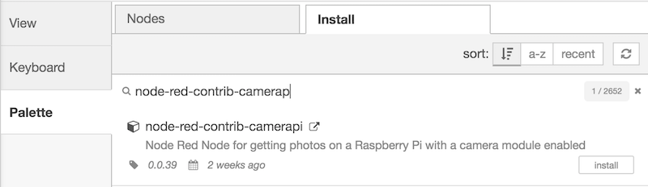
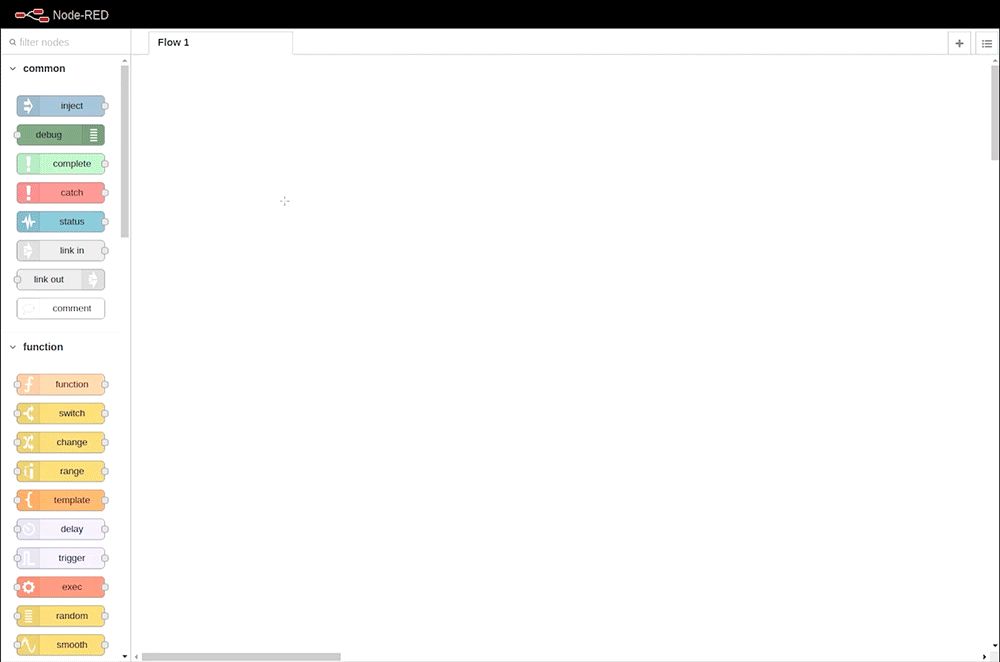
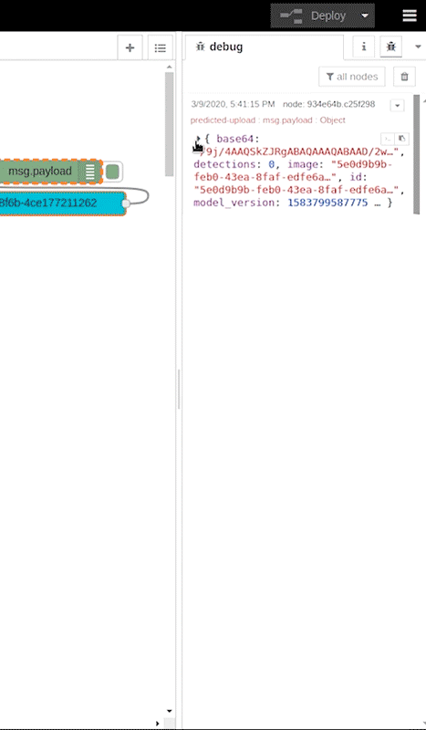
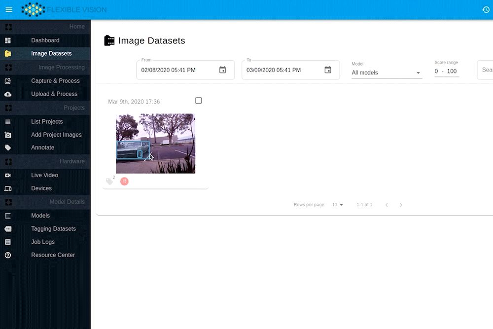

# Flexible Vision
### Detection Nodes For Node Red

Package contains the following nodes:

* **onprem-upload** - runs prediction on an uploaded image file

* **onprem-snap**   - runs prediction on a captured image from detected camera

* **cloud-upload** - runs prediction in the cloud on image file

* **Configure Camera** - Sets a configuration on the selected vision camera

* **Release Camera** - Releases camera acquisition of the selected vision camera

* **Open Camera** - Starts camera acquisition of the selected vision camera

**Disclaimer:** *To use the onprem nodes you must have a running Flexible Vision [ONPREM SERVER](https://www.flexiblevision.com/product/fv-starter-kit).*

## Getting Started
Cloud Upload Setup

---
This node allows you to quickly deploy your AI vision models on your edge device. The following simple tutorial will have you creating and running your AI models in under 10 minutes. 

* Video Tutorial: [Cloud Node Setup](https://youtu.be/3GKQbuQ2cCQ)

### Step 1: Create an Account
Create a free Flexible Vision account by entering your email and password.

[CREATE ACCOUNT](https://flexiblevision.com/wp-login.php)

### Step 2: Install the Node
Install the **node-red-contrib-fv-detection-nodes** node via the Manage Pallet tool within node-red. 

You can optionally install the node to your node-modules folder through your typical npm terminal command: **npm install node-red-contrib-fv-detection-nodes**

### Step 3: Install Camerapi node (optional)
Install the optional camerapi node if acquiring an image through the raspberry pi camera. Otherwise skip this step.

### Step 4: Create the Flow

Import the following flow into your node-red sketch:

    [{"id":"3fcba4be.c7525c","type":"inject","z":"dbed9a85.13e278","name":"","topic":"","payload":"","payloadType":"date","repeat":"60","crontab":"","once":false,"onceDelay":0.1,"x":130,"y":140,"wires":[["20e65868.257208"]]},{"id":"20e65868.257208","type":"camerapi-takephoto","z":"dbed9a85.13e278","filemode":"1","filename":"image.jpg","filedefpath":"1","filepath":"","fileformat":"jpeg","resolution":"10","rotation":"0","fliph":"0","flipv":"0","brightness":"50","contrast":"0","sharpness":"0","quality":"80","imageeffect":"none","exposuremode":"auto","iso":"0","agcwait":"1.0","led":"0","awb":"auto","name":"","x":300,"y":140,"wires":[["98730e7f.472a3"]]},{"id":"98730e7f.472a3","type":"file in","z":"dbed9a85.13e278","name":"Save Image","filename":"/home/pi/Pictures/image.jpg","format":"utf8","chunk":false,"sendError":false,"encoding":"none","x":470,"y":140,"wires":[["89060b2d.967d38"]]},{"id":"89060b2d.967d38","type":"cloud-upload","z":"dbed9a85.13e278","username":"","password":"","project":"","auth":"","x":770,"y":140,"wires":[["934e64b.c25f298"]]},{"id":"934e64b.c25f298","type":"debug","z":"dbed9a85.13e278","name":"","active":true,"tosidebar":true,"console":false,"tostatus":false,"complete":"false","x":1090,"y":140,"wires":[]}]

### Step 5: Update Your Credentials & Select Example Project
Double click on the Cloud Upload Node and type in your Flexible Vision username and password. 

Select Example Project from projects list.

Click “Done”, then click “Deploy”.

### Step 6: Seeing Your Results

Within the debug window you can see all of the objects found in its raw json format. You can also visually see your results by logging into your Flexible Vision portal and reviewing your Detection History.

Visit the [Resource Center](https://flexiblevision.com/resource-center/) for more information.

[Flexible Vision](https://www.flexiblevision.com)
